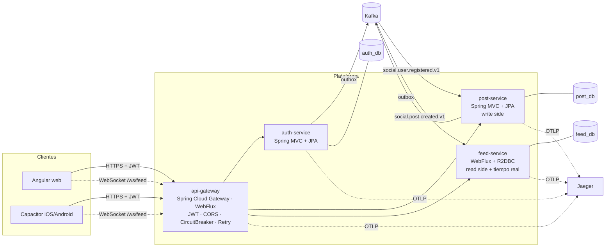
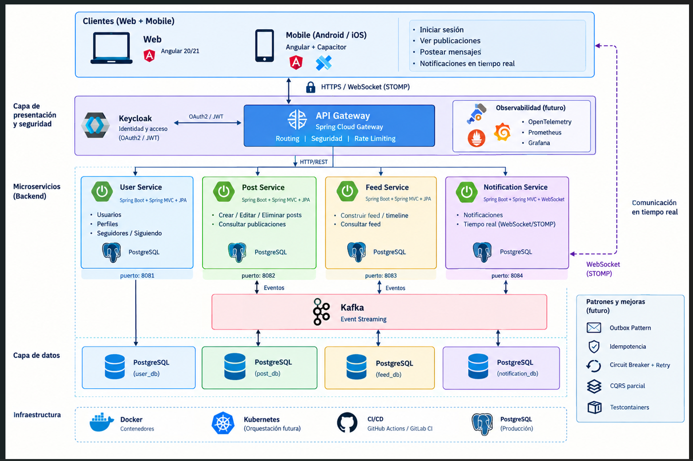

# Red Social — Backend (microservicios)

Backend prueba técnica de una red social (Periferia social dev) donde los usuarios inician sesión, ven las publicaciones de otros usuarios en tiempo real y publican mensajes.
Construido con **Java 21 + Spring Boot 3.5**, arquitectura **hexagonal**, **Kafka** para eventos, **PostgreSQL**, **WebFlux/WebSocket** para tiempo real, y patrones de resiliencia y consistencia aplicados sin sobrecargar el MVP.

> Frontend (Angular 21 + Capacitor): [PruebaTecnicaPeriferiaIT_Frontend](https://github.com/jgaleano2018/PruebaTecnicaPeriferiaIT_Frontend)

---

## 1. Arquitectura



| Servicio | Puerto | Stack | Responsabilidad |
|---|---|---|---|
| **api-gateway** | 8080 | Spring Cloud Gateway (WebFlux) | Punto de entrada único. Valida JWT en el borde, CORS (web + Capacitor), Circuit Breaker y Retry por ruta, proxy WebSocket, Swagger UI agregado. |
| **auth-service** | 8081 | Spring MVC + JPA/Hibernate | Login usuario/clave → JWT (HS256). Seeder de usuarios de prueba. Emite `UserRegistered`. |
| **post-service** | 8082 | Spring MVC + JPA/Hibernate + Kafka | Lado de **escritura**: crear publicación (idempotente) y emitir `PostCreated` vía Outbox. Crea la publicación inicial de cada usuario sembrado. |
| **feed-service** | 8083 | WebFlux + R2DBC + Kafka + WebSocket | Lado de **lectura**: proyección del feed en PostgreSQL, listado reactivo paginado y difusión en tiempo real (WebSocket y SSE). |

Los 4 microservicios se separan por **tipo de carga**: autenticación (poco frecuente, CPU por BCrypt), escritura (transaccional), lectura (muy frecuente, escalable y reactiva) y borde (I/O puro).

### Diagrama de arquitectura



### Flujo de una publicación

1. El cliente hace `POST /api/v1/posts` con `Idempotency-Key` → gateway → post-service.
2. post-service guarda **en una sola transacción** la publicación, el registro de idempotencia y el evento en `outbox_event`.
3. El **Outbox Relay** publica el evento en `social.post.created.v1` (Retry + Circuit Breaker).
4. feed-service lo consume dos veces con propósitos distintos:
   - **Proyección** (grupo compartido): lo inserta en `feed_item` (idempotente por `eventId`).
   - **Difusión** (grupo único por instancia): lo empuja a los clientes WebSocket/SSE conectados a *esa* réplica.
5. Los demás usuarios reciben el mensaje `POST_CREATED` en su WebSocket al instante.

---

## 2. Patrones y principios aplicados

| Patrón / principio | Dónde |
|---|---|
| **Arquitectura hexagonal** (puertos y adaptadores) | Cada servicio: `domain` (modelo + puertos `in`/`out`), `application` (casos de uso sin Spring), `infrastructure` (adaptadores web, persistencia, mensajería, config). |
| **Transactional Outbox** | `platform-mvc-commons/.../outbox` (`OutboxWriter`, `OutboxRelay` con `FOR UPDATE SKIP LOCKED`). |
| **Idempotencia (API)** | `Idempotency-Key` en `POST /api/v1/posts` → `CreatePostService` + tabla `idempotency_key` con restricción única; maneja la carrera concurrente. |
| **Idempotent Consumer** | Tabla `processed_event` en post-service y feed-service (`INSERT … ON CONFLICT DO NOTHING`). |
| **Circuit Breaker + Retry** | Gateway (por ruta, Retry solo en GET) y Outbox Relay → Kafka (Resilience4j). Consumidores Kafka: backoff exponencial + **Dead Letter Topic**. |
| **CQRS parcial** | Escritura en post-service (JPA), lectura en feed-service (modelo desnormalizado, R2DBC). Mismo motor (PostgreSQL), bases separadas. |
| **Observabilidad distribuida** | Micrometer Tracing + OpenTelemetry (OTLP) → Jaeger; propagación de trazas HTTP y Kafka; `traceId` en logs y en cada error; métricas Prometheus en `/actuator/prometheus`. |
| **Testcontainers** | Pruebas `*IT` contra PostgreSQL real con las migraciones Flyway. |
| **SOLID** | SRP por caso de uso; OCP con puertos; LSP en adaptadores intercambiables; ISP con puertos pequeños; **DIP**: la aplicación depende de interfaces y se compone en `UseCaseConfig` (composition root). |
| **DRY** | `shared-kernel` (eventos, errores), `platform-core` (ProblemDetail, JWT) y `platform-mvc-commons` (Outbox, errores MVC, seguridad) reutilizados por los servicios. |
| **Patrones GoF / empresariales** | Adapter (puertos/adaptadores), Factory Method (`User.register`, `Post.publish`), Value Object (`PostMessage`, `FeedCursor`), Strategy (`PasswordHasher`, `AccessTokenIssuer`), Observer/Pub-Sub (`SinkFeedNotifier` + Kafka), Template Method (`ResponseEntityExceptionHandler`), Decorator (Resilience4j), Builder (JWT claims), Unit of Work (`UnitOfWork`). |

---

## 3. Estructura del repositorio

```
├── shared-kernel/          # Contratos puros Java: eventos de integración, excepciones, ErrorCode
├── platform-core/          # ProblemDetail RFC 7807, propiedades/clave JWT, AuthenticatedUser
├── platform-mvc-commons/   # Outbox + relay resiliente, manejo de errores MVC, JWT resource server, OpenAPI
├── auth-service/
│   └── src/main/java/com/periferia/social/auth
│       ├── domain/           model · port/in · port/out
│       ├── application/      service (casos de uso)
│       └── infrastructure/   adapter/in/{web,seed} · adapter/out/{persistence,security,messaging} · config
├── post-service/           # misma estructura hexagonal
├── feed-service/           # misma estructura, adaptadores reactivos (R2DBC, WebSocket, SSE)
├── api-gateway/
├── infra/postgres/         # script que crea una BD por servicio
├── docker-compose.yml
└── .env.example
```

---

## 4. Endpoints

Todo se consume a través del gateway `http://localhost:8080`.

| Método | Ruta | Auth | Descripción |
|---|---|---|---|
| `GET` | `/api/v1/auth/login` | `Authorization: Basic base64(usuario:clave)` | **Login (GET)** → JWT. Las credenciales viajan en cabecera, nunca en la URL. |
| `POST` | `/api/v1/auth/login` | — | Login alternativo con cuerpo `{ "username", "password" }`. |
| `GET` | `/api/v1/auth/me` | Bearer | Perfil del usuario autenticado. |
| `POST` | `/api/v1/posts` | Bearer (+ `Idempotency-Key` opcional) | **Crear publicación** `{ "message" }`. Autor = usuario del JWT; fecha = asignada al guardar. `201` nueva · `200` reintento idempotente · `409` clave reutilizada. |
| `GET` | `/api/v1/posts/{id}` | Bearer | Consultar una publicación. |
| `GET` | `/api/v1/feed?size=20&cursor=…` | Bearer | **Listar publicaciones de otros usuarios**, más recientes primero, paginación keyset. |
| `GET` | `/api/v1/feed/stream` | Bearer | Server-Sent Events con publicaciones nuevas. |
| `WS` | `/ws/feed?access_token=<JWT>` | JWT en query | WebSocket en tiempo real: mensajes `CONNECTED`, `POST_CREATED`, `HEARTBEAT`. |

**Swagger UI agregado:** http://localhost:8080/swagger-ui.html (selector con los 3 servicios; botón *Authorize* para pegar el JWT).

### Errores (RFC 7807)

Todas las respuestas de error son `application/problem+json` con un `code` estable para el cliente y el `traceId` para buscar la traza en Jaeger:

```json
{
  "type": "https://api.periferia-social.dev/errors/validation-error",
  "title": "Bad Request",
  "status": 400,
  "detail": "La petición contiene datos inválidos",
  "instance": "/api/v1/posts",
  "code": "VALIDATION_ERROR",
  "timestamp": "2026-09-28T21:30:00Z",
  "traceId": "6f1c0e7a2b...",
  "errors": [{ "field": "message", "message": "El mensaje es obligatorio" }]
}
```

Nunca se exponen stack traces ni mensajes internos; los errores inesperados se registran en el log con su traza.

---

## 5. Puesta en marcha

### Requisitos
- Docker 24+ con Docker Compose v2 (para todo el stack)
- Opcional para desarrollo local: JDK 21 y Maven 3.9+

### Con Docker Compose (recomendado)

```bash
cp .env.example .env          # revise/cambie secretos (JWT_SECRET, contraseñas)
docker compose up -d --build  # la primera vez tarda por la descarga de dependencias
docker compose ps             # espere a que todos estén "healthy"
```

> **¿Puerto ocupado?** Si ya tiene algo en el 8080 (p. ej. Keycloak) o un PostgreSQL local en el 5432, cambie en `.env`
> `GATEWAY_HOST_PORT` (y `OPENAPI_SERVER_URL`) y `POSTGRES_PORT`, y apunte el frontend al nuevo puerto (`.env.local`).

| URL | Qué es |
|---|---|
| http://localhost:8080/swagger-ui.html | Swagger agregado (o el puerto de `GATEWAY_HOST_PORT`) |
| http://localhost:16686 | Jaeger (trazas distribuidas) |
| http://localhost:8090 | Kafka UI (opcional: `docker compose --profile tools up -d`) |

### Usuarios de prueba (seeder)

Al arrancar, auth-service crea (de forma idempotente) los usuarios **alice, bob, carol y david** con la clave de `SEED_DEFAULT_PASSWORD` (por defecto `Password123*`). Cada alta emite `UserRegistered(seeded=true)` y post-service crea **una publicación inicial por usuario**, recorriendo el mismo flujo Outbox → Kafka → consumidor idempotente que usa producción.

```bash
# Login (GET + Basic)
TOKEN=$(curl -s -u alice:Password123* http://localhost:8080/api/v1/auth/login | jq -r .accessToken)

# Feed (publicaciones de los demás)
curl -s -H "Authorization: Bearer $TOKEN" "http://localhost:8080/api/v1/feed?size=10" | jq

# Publicar (idempotente)
curl -s -X POST http://localhost:8080/api/v1/posts \
  -H "Authorization: Bearer $TOKEN" -H "Content-Type: application/json" \
  -H "Idempotency-Key: $(uuidgen)" -d '{"message":"Hola desde curl"}' | jq
```

### Script SQL de usuarios de prueba

`infra/postgres/seed-test-users.sql` inserta (de forma idempotente) los usuarios **alice, bob, carol, david, eva y felipe** con clave `Password123*` en `auth_db`, y registra un evento `UserRegistered` en el outbox para que se cree su publicación inicial. Útil para recrear los datos sin reiniciar el servicio:

```powershell
Get-Content infra/postgres/seed-test-users.sql | docker exec -i social-postgres psql -U postgres -d auth_db
```

### Desarrollo local (servicios en el IDE)

```bash
docker compose up -d postgres kafka jaeger
# Exporte las variables de .env con host "localhost" (p. ej. AUTH_DB_URL=jdbc:postgresql://localhost:5432/auth_db,
# KAFKA_BOOTSTRAP_SERVERS=localhost:29092) y ejecute cada servicio:
mvn -pl auth-service -am spring-boot:run
```

---

## 6. Configuración

**Ningún secreto ni cadena de conexión está en el código.** Todo se resuelve desde variables de entorno (ver `.env.example`, documentado por secciones): credenciales de BD y URLs JDBC/R2DBC, `JWT_SECRET` / `JWT_ISSUER` / `JWT_EXPIRATION`, Kafka y tópicos, seeder, puertos, URIs de enrutamiento del gateway, CORS, parámetros de resiliencia, tiempo real y observabilidad. Las propiedades críticas se validan al arrancar (p. ej. `JWT_SECRET` ≥ 32 caracteres).

---

## 7. Pruebas

```bash
mvn test      # pruebas unitarias (JUnit 5 + Mockito + AssertJ, WebMvcTest/WebFluxTest, StepVerifier)
mvn verify    # + pruebas de integración *IT con Testcontainers (requiere Docker)
```

| Nivel | Qué cubre |
|---|---|
| Dominio | Invariantes de `User`, `PostMessage`, `FeedCursor`, `ErrorCode`. |
| Aplicación | Login (incluida la mitigación de timing), registro + outbox, creación idempotente (replay, clave reutilizada, carrera concurrente), consumidor idempotente, paginación keyset, filtro del stream. |
| Adaptadores web | Contratos HTTP, validación, seguridad 401, formato ProblemDetail (MockMvc / WebTestClient). |
| Infraestructura | Outbox relay (orden y fallos), fallback del gateway. |
| Integración (Testcontainers) | Repositorios JPA y R2DBC contra PostgreSQL real + Flyway: unicidad de Idempotency-Key, `ON CONFLICT`, orden y paginación del feed. |

---

## 8. Decisiones técnicas y trade-offs

- **Login por GET**: el requerimiento pide GET; se implementa con `Authorization: Basic` para no exponer credenciales en URL, historial ni logs de acceso. Se ofrece también `POST` (recomendado en producción). La respuesta lleva `Cache-Control: no-store`.
- **JWT HS256 compartido**: simple para el MVP. Evolución natural: RS256 con JWKS publicado por auth-service, para que los demás servicios solo tengan la clave pública.
- **Entrega at-least-once**: el Outbox puede reenviar un evento si el proceso cae entre publicar y marcar; por eso todos los consumidores son idempotentes.
- **Tiempo real escalable**: cada réplica de feed-service consume con un grupo propio para difundir a sus sockets; no requiere sesiones pegajosas ni Redis.
- **Paginación keyset** (`published_at, post_id`) en vez de OFFSET: estable mientras llegan publicaciones nuevas y eficiente con índices.
- **Dominio reactivo**: los puertos de feed-service exponen `Mono`/`Flux` (Reactor es una librería, no un framework); el dominio sigue sin depender de Spring.
- **Fuera del MVP (siguientes pasos)**: registro público de usuarios, refresh tokens, rate limiting en el gateway (Redis), Schema Registry/Avro para contratos de eventos, Kubernetes + HPA sobre feed-service.
